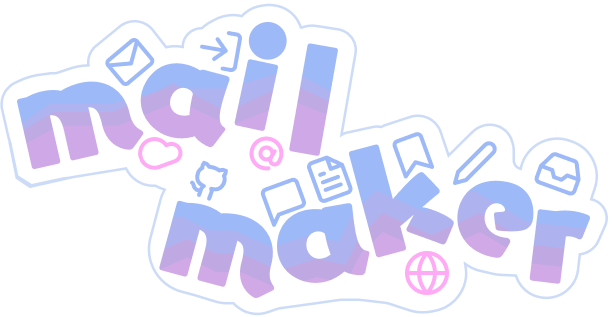

<div align = "center">  </div>
<div id="user-content-toc">
  <ul align="center" style="list-style: none;">
    <summary>
      <h1>Automate your emails with templates!</h1>
      <br />
      <h2>Try it out <a href="https://thecashmoney.github.io/mail-maker/">here</a>!</h2>
    </summary>
  </ul>
</div>
<h1></h1>
<div align="center">
	Languages and tools used <br><br>
	<code></code>
	<code></code>
	<code></code>
	<code></code>
	<code></code>
	<code></code>
	<code></code>
</div>
<br />

## A NOTE ON PRIVACY
When you try and sign into the app, you will be warned that this app is **not verified**. This is because this app **requires** Google's API to send emails. As a result, I am requesting two scopes:
- gmail.send (I can send emails through your account, so I can send the emails you want)
- documents.get (I can read google docs from your account- I need this so I can access template documents that you use)
These scopes are marked as *sensitive*, and my app needs to undergo a verification process by google. However, I need to make a privacy policy, and so on, which is out of scope for me and in this timeline. If you still do not trust this app, you can look at where the sensitive code is by scrolling down to the appendix, or watch the video [here](https://cloud-fkmqplkow-hack-club-bot.vercel.app/0mail-maker_video.mp4).

To proceed, do the following:
- You will get a warning screen. Click advanced.
- Click go to mail-maker-1bd49.firebaseapp.com.
	- My developer email is elliottjang1@gmail.com!
- Click continue.
- If you plan on using the templates feature, click "See all your google docs documents." Recommended for long term use!
- Click "send email on your behalf."
- Click continue.
- You are logged in!
## SCREENSHOTS


## INSPIRATION
This app was mostly inspired by club emails. The ones you send every week, reminding people to go to meetings. The problem was, no one wanted to write these. I scoured the school for reliable secretaries, but even they can get tired. To remove the tediousness of writing emails, I created mail-maker.
## USAGE
1. Add in an email, or a spreadsheet of emails (like a club attendance sheet)
2. Write your subject
3. Paste the link to a template, or write out the body
	1. If you put in a link to a template, load the template and fill out your fields
4. Click send!

If you want to save a template, simply name your template and click the save button at the bottom. 

## MAKING TEMPLATES

To make a template, all you need to do is create a [google doc](https://docs.google.com)!
Mail-maker supports *italics*, **bold**, and underlined text. You can also add links.
You can add fields into your template. In your doc, simply add a backslash ("\\") into the fields you want.
For example: `\name\` in your google doc creates a field called `name`.
These fields will be generated when you click the load button in a template, and you can fill them out!
| Add a field | Load your field | Email result |
| --- | --- | --- |
|  |  |  |


## CREDITS
- [Theme switcher I used](https://web.dev/articles/building/a-theme-switch-component)
- [ethansocal](https://github.com/ethansocal) for technical support
- Logo developed with help from Hack Club's [Anchor YSWS](https://anchor.hackclub.com/)

## APPENDIX
My code has two places where it is using sensitive code. 

In `src/data/data.js`, under `export async function getTemplate(formValues, addFormField)`:
``` js
const response = await fetch('https://docs.googleapis.com/v1/documents/' + match[1], {

	method: 'GET',

	headers: {

		'Authorization': 'Bearer ' + token,

		'Accept': 'application/json',

	}

});
```
I retrieve your template document here. You will provide the link to the template document. I cannot access any document without your permission (even if they are publicly available).

In `functions/index.js` , under `async function sendMail`
``` js
const gmail = google.gmail({version: "v1", auth: oauth2Client});

  gmail.users.messages.send({

    userId: "me",

    resource: {

      raw: reallyEncodedMessage,

    },

  }).then(() => {

    console.log("sent!");

  }).catch((error) => {

    console.error("Error sending email:", error);

  });
```
Here, I call the gmail.send function. This sends over your message through your gmail account.
<hr/>
